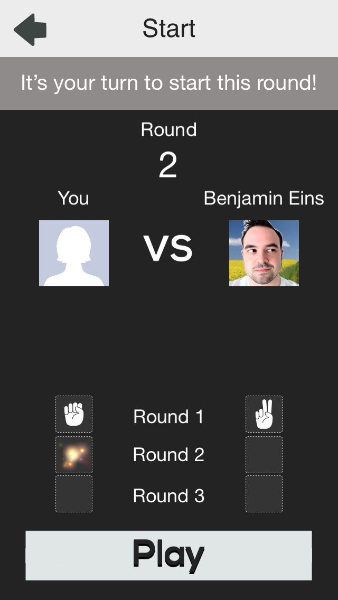

#Rock, Paper, Scissors - A simple turn based multiplayer game

This game is an example and a template for the multiplayer functionality of the MGWU SDK. The goal of the game is to win against Facebook friends in three rounds of Rock, Paper, Scissors:

##Scene Structure of the Game

###MainScene
Displays a list of all current games, divided into three categories:
- Games where it is the players turn
- Games where it is the opponents turn
- Games that are completed

Allows to "Play now" which will either continue an existing game, start a new game against a friend which whom the player hasn't started a game yet or will start a game against a random other player of the game.

###FriendListScene
This scene lists all Facebook players who are also playing the game. From where a player can start games against his friends. An "invite Friends" button allows players to invite Facebook friends who aren't playing the game yet.

###PreMatchScene
Displays the current state of the game including all previous rounds. Is also used to display games that are completed.

###GameplayScene
This scene allows the player to perform a move and choose between Rock, Paper and Scissors.

###RoundResultScene
Displayed after each round is complete (each player has chosen either Rock, Paper or Scissors). This scene will fade both choices in slowly and then display wether the player has lost or won against the opponent, or wether this round was a draw.

##Important Classes/Files

###UserInfo
The `UserInfo` class stores all of the information received from the MGWU server. You should read the [documenation of the MGWU SDK](https://s3.amazonaws.com/mgwu/mgwuSDK-instructions.html) to get an overview of the available methods and information provided by the SDK. The `UserInfo` class calls the following method of the MGWU SDK:

	  [MGWU getMyInfoWithCallback:@selector(refreshCompleted:) onTarget:self];

and stores the results in a structurded manner. The `UserInfo` class provides different properties to provide easy access to the information received from the MGWU SDK server.

`UserInfo` is implemented as a singleton. If you want to access information do it as follows:
 
 	// access username
 	NSString *playerUsername = [[UserInfo sharedUserInfo] username];

 If you want to the `UserInfo` class to download the latest information from the MGWU server you should call:
 
	 [[UserInfo sharedUserInfo] refreshWithCallback:@selector(yourCallback) onTarget:self];

The callback you provide within this method call will be called as soon as the data is retrieved from the server.

##GameDataUtils
`GameDataUtils` is a collection of convenience functions that make it easier to extract relevant information from the data provided by the MGWU SDK.

Here are two examples:

    /** 
     Performs the specified move for the provided player and game. This function sends the move to the MGWU server. After
     sending is complete the callback is called on the target.
     */
    extern void performMoveForPlayerInGame(NSString *move, NSString *playerName, NSDictionary* game, id target, SEL callback);

    /**
     Calculates the winner of the two provided choices.
     0 = draw between both choices
     -1 = choice 1 wins
     +1 = choice 2 wins
     */
    extern NSInteger calculateWinnerOfRound(NSString *movePlayer1, NSString *movePlayer2);
    
If you find yourself adding complex code to some of your scenes in order to extract information from the MGWU SDK you should consider adding them as convenience functions to the `GameDataUtils` collection.
	